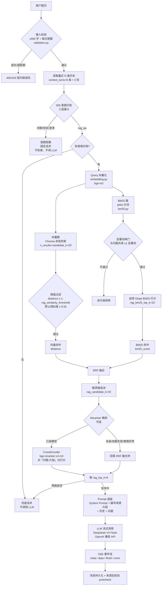

# AI 架构设计

> `docs/` 为项目总体文档；各模块规格见 [`../specs/`](../specs/)。

## 1. RAG 完整流程图（模块 001 问答链路）

问答请求从输入校验到响应落库的完整链路，含 006 意图识别短路分支与空检索兜底：



链路要点：

- **意图短路（006）**：闲聊 / 投诉 / 澄清在识别后直接返回固定话术，**不检索、不调 LLM**（[chat.py](backend/app/api/chat.py) 中 `route_intent` 分发）。
- **只召回「就绪」文档**：检索前先过滤 `KnowledgeDoc.status == "就绪"` 的切片，无就绪文档即空检索。
- **空检索兜底**：向量、BM25 两路皆空时输出固定兜底话术，不进入 LLM 生成。
- 实现文件：检索链路 [retriever.py](backend/app/services/rag/retriever.py) / [bm25.py](backend/app/services/rag/bm25.py) / [reranker.py](backend/app/services/rag/reranker.py)，Prompt 组装 [prompt.py](backend/app/services/rag/prompt.py)。

## 2. Prompt 模板设计

### 2.1 System Prompt（固定，见 [prompt.py:11-15](backend/app/services/rag/prompt.py#L11-L15)）

```
你是 AI 智能客服助手。回答必须严格依据下面编号的知识片段，
禁止使用片段之外的任何信息编造内容。若片段不足以回答，
请明确告知无法回答。回答应引用片段中提供的事实。
```

约束要点：**强依赖编号片段、禁止编造、片段不足必须明说**——这是幻觉抑制（FR-005/FR-006）的 prompt 层防线，与「空检索兜底」共同作用。

### 2.2 检索结果注入模板（CHUNK_TEMPLATE）

每个命中的知识片段按如下模板编号并注入来源元信息：

```
【{i}】来源：{doc_name}｜片段：{snippet}
{text}
```

多个片段以空行拼接，组成 `system` 消息正文，紧跟 System Prompt 之后（[format_chunks](backend/app/services/rag/prompt.py#L20-L27)）：

```
你是 AI 智能客服助手。回答必须严格依据下面编号的知识片段……

【1】来源：售后政策.md｜片段：退货退款时效
退货退款一般在 3-5 个工作日内原路退回。

【2】来源：FAQ.md｜片段：退款到账
退款到账时间以银行处理为准，通常 1-3 个工作日。
```

- `doc_name`：来源文档名；`snippet`：切片小标题/摘要；`text`：切片正文。
- 编号从 1 连续递增，供 LLM 引用与前端 `reference_source` 回显对齐。
- **来源去重**：进入 prompt 前按 `doc_name + snippet` 去重（[chat.py:73-82](backend/app/api/chat.py#L73-L82)），同一来源重复片段只保留首条。

### 2.3 消息组装顺序（build_messages）

```
messages = [
    {role: "system", content: SYSTEM_PROMPT + "\n\n" + 编号片段…},   # 片段拼在 system
    {role: "user" / "assistant", content: 最近历史[0]},              # 历史逐条铺开（ai → assistant）
    …，
    {role: "user", content: 当前问题},                                # 问题放最后
]
```

- **历史拼接**：数据库里 AI 消息 `role="ai"`，LLM API 期望 `role="assistant"`，组装时映射（[prompt.py:30-37](backend/app/services/rag/prompt.py#L30-L37)）。
- **检索结果进 system 而非 user**：知识片段对每次问答都属「背景材料」，放 system 区避免被当作对话内容参与多轮滚动，且 LLM 对 system 中的编号引用约束遵从性更强。
- 每片段默认 ≤ `chunk_size=500` 字，6 条 ≈ 3000 字。

### 2.4 上下文预算与截断（FR-011）

字符近似 token：`1 字 ≈ 1/1.5 token`（保守值）。预算 = `context_max_tokens × 1.5` 字符 = **6000 × 1.5 = 9000 字符**。

超限降级顺序（严禁先丢知识，答案依据优先保留）：

1. **丢最早历史**（按消息边界逐条弹出，最多可丢光历史）；
2. 仍超 → **从末尾减知识片段**（`format_chunks` 重新编号，保持连续）；
3. 片段也减光时 system 回落为纯 SYSTEM_PROMPT（已无知识 → 实际由空检索兜底拦住，理论分支）。

## 3. 向量检索策略：阈值与 Top-K

### 3.1 参数一览

| 参数 | 默认值 | 语义 |
|---|---|---|
| `rag_similarity_threshold` | **0.55** | 向量路相似度阈值（**相似度**口径） |
| `rag_top_k` | **6** | 最终送入 LLM 的知识片段数 |
| `rag_candidate_k` | **20** | RRF 融合后的粗筛候选池规模（送 Reranker 精排） |
| `rag_bm25_top_k` | **20** | BM25 单路召回上限 |
| `rag_rrf_k` | **60** | RRF 融合常数 k |

以上默认值定义在 [config.py](backend/app/config.py#L61-L68)；运行时均可经 `system_config` 表热调（[config_service.py](backend/app/services/config_service.py) 的 `get_config_value`），未配置回落默认值。

### 3.2 阈值语义与换算（为什么是 0.55）

**阈值是「相似度」口径，但 Chroma 返回「余弦距离」，换算关系**：

```
相似度 similarity ≥ threshold  ⟺  距离 distance ≤ 1 - threshold
默认：cosine ≥ 0.55  ⟺  distance ≤ 0.45
```

实现见 [retriever.py:102-103](backend/app/services/rag/retriever.py#L102-L103)：`distance > 1 - threshold` 的切片直接跳过。

取值理由：

- **作用在粗筛候选上而非全库**：先取 `candidate_k=20` 条最近邻，再对这 20 条做阈值过滤。阈值是「候选池内再收紧」的精调旋钮，不是全库扫描的硬门槛，故可以设得相对宽松而不引入检索延迟。
- **0.55 是召回率与精确率的平衡点**：客户口语化问法（如「退钱要多久」）与知识库书面表述的向量相关度通常低于书面直问（如「退款多久到账」）。阈值偏高会把这类改写漏掉；偏低又会混入业务无关的「语义接近」片段（如把「配送时效」当「退款时效」召回），稀释上下文并放大幻觉。0.55 对 bge-m3 语义向量是一个偏宽松的保守默认，**宁可多召回交给 Reranker 精排取舍**。
- **可热调**：不必改代码，管理员可在 `system_config` 中按业务实际调整——调高更严格（精确率优先），调低更宽松（召回率优先）。
- **只作用于向量路**：BM25 路没有分数阈值，靠「显著词闸门 + 排序截断 `bm25_top_k`」把关（详见 §1 关键决策）。

### 3.3 Top-K 取值与理由

| 层 | 值 | 为什么 |
|---|---|---|
| `rag_candidate_k` | **20** | ≈ 3.3× `top_k`，给 Reranker 足够的重排空间让「语义正确但字面不近」的片段有机会进位；同时把 CrossEncoder 的「问题-片段」对推理量锁死在 20 对以内，控制首字延迟。 |
| `rag_bm25_top_k` | **20** | 与候选池规模对齐：BM25 单路贡献与向量路对等（不淹没 RRF），并防止高分但同质的片段刷屏候选池。 |
| `rag_top_k` | **6** | 最终进 LLM 的片段数。理由：① **上下文预算**：每片段 ≤500 字，6 条 ≈ 3000 字 ≈ 2000 token，在 6000-token 预算内给 System Prompt + 历史 + 问题留足余量；② **覆盖面**：售后类问题常跨多要点、多文档，6 条足够覆盖典型 FAQ 的多来源回答；③ **注意力质量**：片段越多注意力越稀释、幻觉风险越高，6 是覆盖度与质量的经验平衡点。 |

**为什么要分三层数量**：`20 → 20 → 6` 是「宽召回 → 精排 → 收窄」的漏斗。向量/BM25 各自召回上限放得宽（召回率优先），Reranker 精排只做 20 对打分（成本可控），最终只把最相关的 6 条送进 LLM（上下文质量优先）。若没有 Reranker（Noop 降级），同样取 6 条，只是按 RRF 融合序取。

### 3.4 阈值作用点与空检索兜底

- **两路皆空**（向量阈值后无命中 且 BM25 无命中）→ `retrieve()` 返回空列表 → 输出固定兜底话术「抱歉，知识库中没有找到相关信息……」，**不调用 LLM**（FR-005）。
- **单路命中**（向量空 / BM25 空）→ 另一路独立贡献进 RRF，不互相阻塞（召回率优先）。
- 兜底与空检索的状态由 008 埋点 `empty` / `vector_after_threshold` 等统计字段记录，可观测。

## 4. 关键设计决策

### 1. 检索策略：双路召回 + RRF 融合（FR-004）

- **为什么双路**：纯向量检索对口语化表述与关键词精确匹配（品牌、型号、货号）召回不足；BM25 关键词路径补齐。两路覆盖「语义相关 + 字面重叠」两种召回信号。
- **为什么 RRF**：向量余弦分与 BM25 分量纲不同、无法直接相加；RRF 只用**排名**融合（`Σ 1/(k+rank)`），免去分数归一化，两路都命中的片段自然排前。
- **显著词闸门**：候选片段须与问题共享 ≥1 显著词（CJK 二元及以上 / ASCII 词 len≥2）才进入 BM25 打分，防止功能字（的/天/么）假阳性破坏空检索兜底语义。
- **自研 Okapi BM25**：jieba 仅分词，打分自研（k1=1.5、b=0.75），满足宪法「核心链路自研可读」。

### 2. 重排序：Reranker 精排（FR-014，可插拔降级）

- Cross-Encoder 对「问题-片段」对打分，把语义相似但业务无关的片段（如「退款时效」vs「配送时效」）压后，提高送入 LLM 上下文的质量，降低注意力稀释与幻觉。
- **可插拔 + 全链路降级**：模型未安装（`find_spec` 检测）→ Noop 保序；加载失败 → `warmup()` 吞异常置 Noop；推理异常 → `retriever` 回落 RRF 融合序。任何一环失败都不影响主链路可用性。
- 精排只对粗筛候选池（20 条）打分，不扫描全库，控制首字延迟。

### 3. 上下文截断（FR-011）

预算 = `context_max_tokens × 1.5 字符/token`。超限时**先按消息边界丢最早历史**，仍超再**从末尾减知识片段**（保持编号连续），严禁先丢知识（答案依据）。详见 §2.4。

### 4. 幻觉抑制（FR-005/FR-006/FR-013）

- 空检索不调用 LLM，输出固定兜底话术，禁止编造。
- System Prompt 强约束「仅依据编号材料回答、无材料输出兜底话术」。
- 输出后来源校验（postcheck）：启发式检出超出知识片段范围的断言，标记「待人工核实」而非静默放行。

### 5. 异常处理（FR-010）

LLM 超时 / 限流 / 服务不可用统一转 SSE `error` 事件（`llm_timeout`/`llm_rate_limited`/`llm_error`）友好返回；错误分支同样持久化 AI 消息，不发空响应、不静默结束。

### 6. 服务端唯一执行（原则三）

检索与 LLM 调用全部后端完成，前端仅通过 REST/SSE 交互，模型 API Key 只存服务端环境变量。

## 5. 后续可拓展方向


| # | 拓展方向 | 现状缺口 | 目标 | 
|---|---|---|---|
| 1 | **RAG query 结构化构造** | 检索直接用用户原始输入 `req.question`，口语 query 与文档书面表述（如「退款时效」）语义不匹配 | 依据 006 意图 + 槽位构造业务术语 query（`query_map[intent]`），未命中回落原输入 | 
| 2 | **检索质量评测闭环** | 无评测集，参数调优缺量化依据 | 标注 50–100 个 QA 对，自动化计算 Hit Rate@k / Recall@k / MRR，bad case 驱动迭代 | 
| 3 | **知识冲突处理** | 元数据 `version_date`/`source_priority` 入库时已附加（[ingester.py](backend/app/services/knowledge/ingester.py)），但检索/prompt 层未消费 | top-k 内检测「同一概念不同数值」冲突 → 时间优先 + 来源优先**先过滤再注入**，避免矛盾片段同时进 LLM | 
| 4 | **元数据过滤检索** | `category`/`source_file` 等元数据已存，`retrieve()` 未按 `where` 过滤 | 意图驱动分类过滤（如售后问题只查 `category=refund`），缩窄召回面 | 
| 5 | **多跳检索** | 单跳 RAG，含指代/跨文档问题（如「上次退的耳机到了吗」）单次检索无解 | 实体解析 → 业务查询 → 知识检索分步执行，设 `max_hops` 与每跳降级 | 
| 6 | **统一执行链路整合** | 已有会话历史（004）+ 意图（006），无画像/事实记忆 | 对齐课程「短期记忆 → 画像 → 意图 → 事实记忆 → RAG」触发顺序与 token 预算多组件分配 |

实施建议：

- **落地顺序**：#1 → #2 → #3 → #4 → #5/#6。#1 改动最小（仅改检索入参）；#2 为后续所有调参提供量化依据；#3/#4 复用已入库的 T013 元数据，改动集中在检索层；#5/#6 涉及编排链路，改动最大。
- **降级原则**：任一拓展保持「增强而非必须」——组件失败不影响主链路可用性。
- **不牺牲召回质量**：token 预算超限时优先压缩历史而非知识片段。
