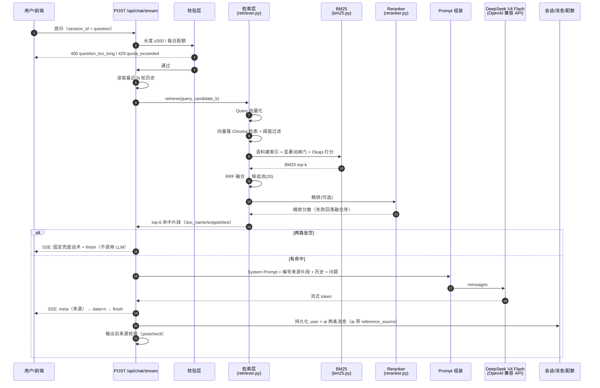
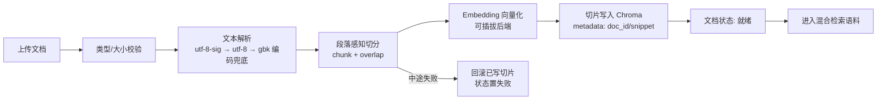

# 业务流程说明

> `docs/` 为项目总体文档；各模块规格见 [`../specs/`](../specs/)。

## 问答完整链路（模块 001 RAG 智能问答）



## 知识库上传处理流程（模块 002，为检索提供语料）



## 状态流转（模块 001 检索链）

```text
请求到达 → 校验通过 → 历史读取 → 混合检索
   ├─ 向量路：Chroma 余弦 → 阈值过滤（distance ≤ 1 - threshold）
   ├─ BM25 路：jieba 分词 → 显著词闸门 → Okapi 打分 → bm25_top_k
   ├─ RRF 融合（k=60）→ 粗筛候选池 candidate_k=20
   ├─ Reranker 精排（可选，缺失/失败回落融合序）→ top_k=6
   ├─ 两路皆空 → 兜底话术（不调用生成）
   └─ 有命中 → Prompt 组装 → LLM 流式 → 持久化 → 后校验
```

配额校验失败 / 长度超限在入口直接拒绝，不进入生成。
