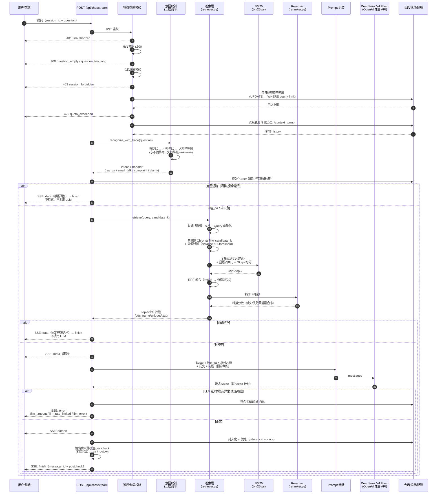
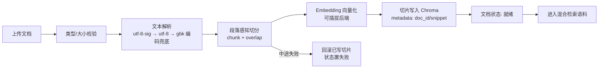

# 业务流程说明

> `docs/` 为项目总体文档；各模块规格见 [`../specs/`](../specs/)。

## 问答完整链路（模块 001 RAG 智能问答）



## 知识库上传处理流程（模块 002，为检索提供语料）



## 状态流转（模块 001 问答链）

```text
请求到达 → JWT 鉴权 → 入口校验（长度 / 会话归属 / 每日配额）→ 多轮历史
  → 意图识别（规则层 → 小模型层 → 大模型兜底，永不抛异常）
     ├─ 闲聊 / 投诉 / 澄清 → 模板回复短路（不检索、不调用 LLM）
     └─ rag_qa / 未识别 → 混合检索
         ├─ 向量路：Chroma 余弦 → 阈值过滤（distance ≤ 1 - threshold）
         ├─ BM25 路：jieba 分词 → 显著词闸门 → Okapi 打分 → bm25_top_k
         ├─ RRF 融合（k=60）→ 粗筛候选池 candidate_k=20
         ├─ Reranker 精排（可选，缺失/失败回落融合序）→ top_k=6
         ├─ 两路皆空 → 兜底话术（不调用 LLM）
         └─ 有命中 → Prompt 组装 → LLM 流式 → 后校验（幻觉检出）→ SSE finish
             └─ LLM 超时 / 限流 / 异常 或 空响应 → SSE error
```

鉴权失败（401）、长度超限（400）、无权访问会话（403）、配额用尽（429）在入口直接拒绝，不进入生成。
