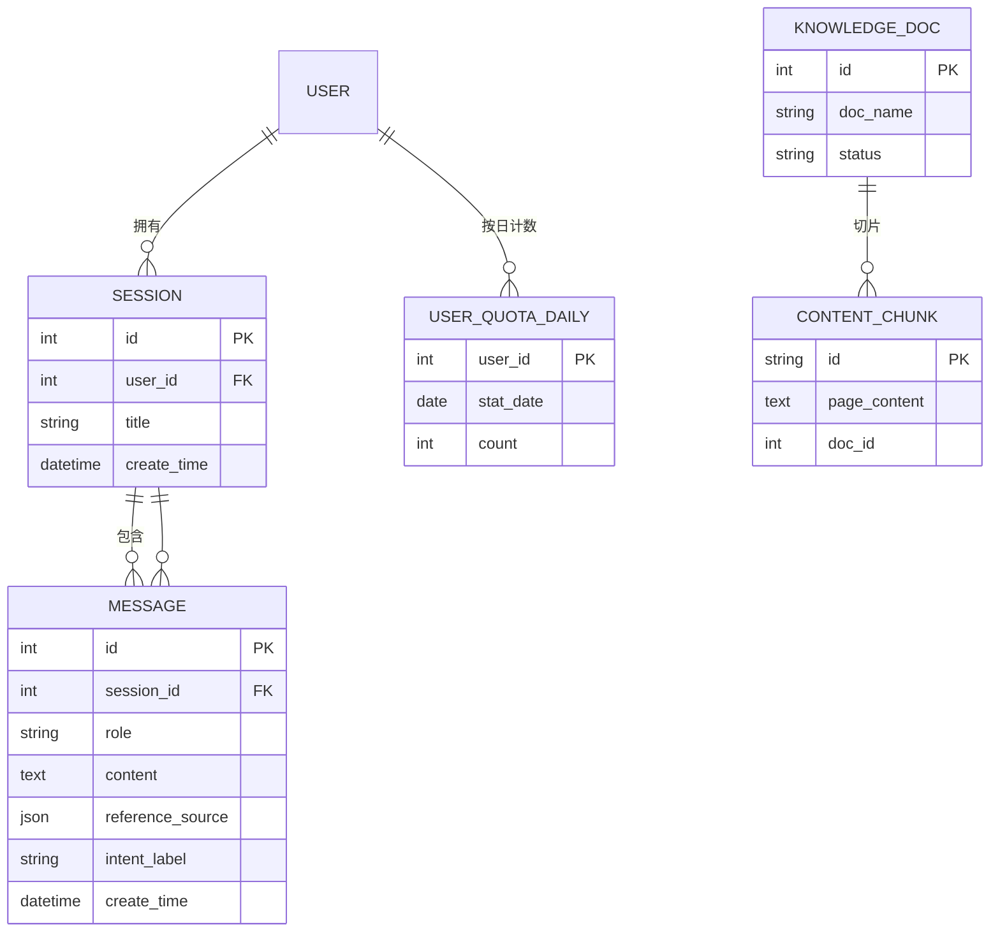

# 数据模型：RAG 智能问答链路

**日期**：2026-08-29 | **特性**：[spec.md](spec.md)

本文件定义 001 特性拥有并操作的实体及其关系。知识库侧实体（KnowledgeDoc / ContentChunk）由 002 特性所有，此处仅记录 001 检索链路所依赖的字段契约。

## 实体总览



## 1. Session（会话）

由 004-session-messages 特性主导 CRUD，本特性只读。承载多轮历史上下文。

| 字段 | 类型 | 约束 | 说明 |
|---|---|---|---|
| id | BIGINT | PK, AUTO_INCREMENT | 会话 ID |
| user_id | BIGINT | NOT NULL, FK → user.id | 所属用户 |
| title | VARCHAR(100) | NOT NULL | 会话标题 |
| create_time | DATETIME | NOT NULL, DEFAULT CURRENT_TIMESTAMP | 创建时间 |

**索引**：`(user_id, create_time)` 支持按用户会话列表查询。

## 2. Message（消息）

本特性负责写入（FR-012：会话结束时持久化问答记录）；CRUD 与查询列表由 004 特性主导。

| 字段 | 类型 | 约束 | 说明 |
|---|---|---|---|
| id | BIGINT | PK, AUTO_INCREMENT | 消息 ID |
| session_id | BIGINT | NOT NULL, FK → session.id | 所属会话 |
| role | ENUM('user','ai') | NOT NULL | 消息角色 |
| content | TEXT | NOT NULL | 消息正文（用户问题 / AI 完整回答） |
| reference_source | JSON | NULL | AI 回答的引用来源数组（见下方结构），用户消息为 NULL |
| intent_label | VARCHAR(50) | NULL | 意图标签（加分项预留，本特性不写入） |
| create_time | DATETIME | NOT NULL, DEFAULT CURRENT_TIMESTAMP | 创建时间 |

**索引**：`(session_id, create_time)` 支持按会话取最近 N 轮历史。

**reference_source 结构**（对应 SSE `meta` 事件）：
```json
[
  { "doc_name": "产品介绍.txt", "snippet": "本产品支持在线客服功能……" },
  { "doc_name": "FAQ.md", "snippet": "退货时限为 7 天……" }
]
```

## 3. UserQuotaDaily（每日提问计数）

本特性全权管理（FR-002 校验与计数）。按 `(user_id, stat_date)` 唯一，保证单用户单日一条计数记录。

| 字段 | 类型 | 约束 | 说明 |
|---|---|---|---|
| id | BIGINT | PK, AUTO_INCREMENT | 主键 |
| user_id | BIGINT | NOT NULL, FK → user.id | 用户 ID |
| stat_date | DATE | NOT NULL | 统计日期 |
| count | INT | NOT NULL, DEFAULT 0 | 当日已用提问次数 |

**唯一约束**：`UNIQUE(user_id, stat_date)`。
**并发安全**：校验 + 递增在同一事务，用 `UPDATE ... SET count = count + 1 WHERE count < :limit` 原子操作，避免并发重复计数（research §7）。

## 4. KnowledgeDoc（知识库文档）— 外部实体，002 特性所有

本特性检索依赖的只读字段：

| 字段 | 类型 | 约束 | 说明 |
|---|---|---|---|
| id | BIGINT | PK | 文档 ID（doc_id） |
| doc_name | VARCHAR(255) | NOT NULL | 文档名称（用于引用来源展示） |
| status | ENUM('处理中','就绪','失败') | NOT NULL | 文档状态；仅「就绪」文档参与检索 |

## 5. ContentChunk（知识切片）— 外部实体，002 特性所有

存储于 Chroma 向量库，本特性经 `retriever` 读取。元数据关联契约：

| 属性 | 说明 |
|---|---|
| page_content | 切片文本 |
| embedding | 1024 维 bge-m3 向量 |
| metadata.doc_id | 关联 MySQL knowledge_doc.id（宪法要求可追溯索引对） |
| metadata.snippet | 来源片段摘要（用于 `meta` 事件 / reference_source） |

## 状态流转

本特性无长期状态机。仅链路内的瞬时流程状态：

```text
请求到达 → 校验通过 → 历史读取 → 向量检索
                                        ├─ 无命中 → 兜底话术（不调用生成）
                                        └─ 有命中 → Prompt 组装 → LLM 流式 → 持久化 → 后校验
```

配额校验失败 / 长度超限在入口直接拒绝，不进入生成。

## 校验规则（来自规格需求）

| 规则 | 来源 | 实现 |
|---|---|---|
| 单条问题 ≤500 字，超长拒绝 | FR-001 | validation.py 长度校验，边界 500 通过、501 拒绝 |
| 每日提问 ≤ 配置上限（默认 100），超限拒绝 | FR-002 | validation.py 配额事务校验 |
| 请求携带最近 N 轮（N 可配置）历史 | FR-003 | history.py 读取 |
| 上下文超长执行截断：丢最早历史、压缩保留知识 | FR-011 | history.py / prompt.py |
| 回答严格限定检索片段范围，禁止编造 | FR-005/FR-006 | 空检索兜底 + System Prompt 约束 |
