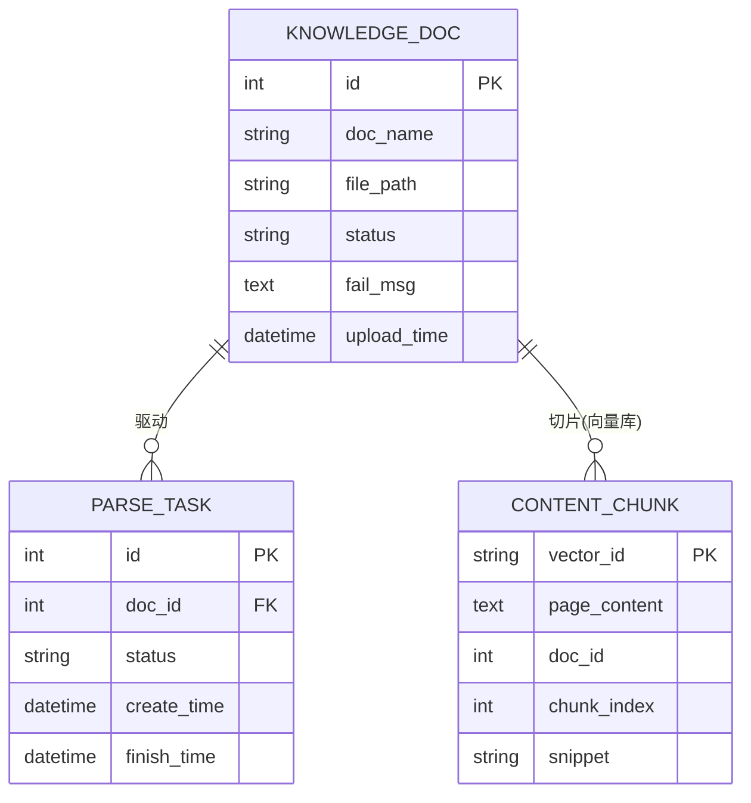

# 数据模型：知识库管理

**日期**：2026-08-29 | **特性**：[spec.md](spec.md)

本特性拥有并操作 KnowledgeDoc、ContentChunk、ParseTask 三个实体。ContentChunk 主体存于 Chroma，元数据契约见下。

## 实体总览



## 1. KnowledgeDoc（知识库文档）

文档元数据主表。状态机：`处理中 →（就绪|失败）`，单向收敛。

| 字段 | 类型 | 约束 | 说明 |
|---|---|---|---|
| id | BIGINT | PK, AUTO_INCREMENT | 文档 ID（doc_id，与向量库 metadata 关联） |
| doc_name | VARCHAR(255) | NOT NULL | 原始文件名（含扩展名） |
| file_path | VARCHAR(500) | NOT NULL | 原始文件存储路径 |
| status | ENUM('处理中','就绪','失败') | NOT NULL, DEFAULT '处理中' | 处理状态 |
| fail_msg | VARCHAR(1000) | NULL | 失败原因（可读，非空仅当 status='失败'） |
| upload_time | DATETIME | NOT NULL, DEFAULT CURRENT_TIMESTAMP | 上传时间 |

**索引**：`(status)` 支持按状态过滤；`(upload_time)` 支持列表排序。

**状态流转**：
```text
(上传) ─→ 处理中 ─成功→ 就绪
              └─失败→ 失败（fail_msg 记录可读原因）
超时守卫：处理中 超时（默认 10 分钟）→ 失败
```

## 2. ContentChunk（知识切片）— 存于 Chroma 向量库

每个切片一条向量记录。向量库内部 ID 确定性生成：`f"{doc_id}-{chunk_index}"`。

| 属性 | 说明 |
|---|---|
| id | 向量库内部 ID = `{doc_id}-{chunk_index}` |
| page_content | 切片文本 |
| embedding | 1024 维 bge-m3 向量 |
| metadata.doc_id | 关联 MySQL knowledge_doc.id（宪法可追溯索引对，FR-005） |
| metadata.chunk_index | 文档内切片序号（用于顺序与回滚定位） |
| metadata.snippet | 片段摘要（切片首部去格式文本，用于 001 `meta` 事件引用来源） |

**级联定位**：删除文档时按 `metadata.doc_id == doc_id` 批量删除全部切片（FR-008）；001 检索时仅在就绪文档的 doc_id 集合内召回。

## 3. ParseTask（解析任务）

后台处理单元，驱动 KnowledgeDoc 状态流转（FR-003 / FR-004）。v1 为进程内任务记录；切换 Celery 时映射为队列消息 + 该记录。

| 字段 | 类型 | 约束 | 说明 |
|---|---|---|---|
| id | BIGINT | PK, AUTO_INCREMENT | 任务 ID |
| doc_id | BIGINT | NOT NULL, FK → knowledge_doc.id | 关联文档 |
| status | ENUM('处理中','成功','失败','已取消') | NOT NULL | 任务执行状态 |
| create_time | DATETIME | NOT NULL | 任务创建时间 |
| finish_time | DATETIME | NULL | 任务完成时间 |
| fail_msg | VARCHAR(1000) | NULL | 失败原因（与文档 fail_msg 同步） |

**索引**：`(status)` 支持超时扫描。

**任务与文档状态联动**：任务终态（成功/失败/已取消）驱动文档状态收敛；「已取消」用于处理中文档被删除的并发场景（research §7），此时文档记录已被级联清理。

## 校验规则（来自规格需求）

| 规则 | 来源 | 实现 |
|---|---|---|
| 仅支持 txt / md（pdf 可选，v1 不承诺） | FR-001 | validator.py 扩展名白名单 |
| 拒绝不支持的格式 / 空文件 / 空内容 | FR-007 | validator.py（扩展名 + MIME + 大小 + 去空白非空） |
| 大小上限可配置，默认 20MB，超限拒绝 | FR-010 | validator.py + 配置 |
| 任一环节失败 → 整份失败并回滚切片 | FR-011 | pipeline.py 事务边界 + 按 doc_id 清理 |
| 删除 → 同步清理原始文件 + 元数据 + 全部切片 | FR-008 | cleaner.py 级联事务 |
| 仅认证且有权限用户可管理 | FR-009 | JWT + 角色校验（003 中间件） |
