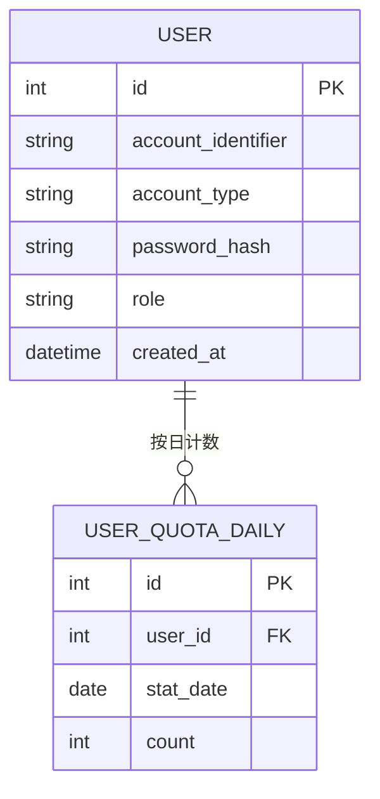

# 数据模型：用户鉴权

**日期**：2026-08-29 | **特性**：[spec.md](spec.md)

本特性拥有并操作 User、UserQuotaDaily 实体。AuthToken 为 JWT 无状态令牌，不落库（不设存储表）。

## 实体总览



## 1. User（用户）

| 字段 | 类型 | 约束 | 说明 |
|---|---|---|---|
| id | BIGINT | PK, AUTO_INCREMENT | 用户 ID（JWT `sub` 载荷） |
| account_identifier | VARCHAR(100) | NOT NULL, UNIQUE | 账号标识：手机号或邮箱（二选一） |
| account_type | ENUM('phone','email') | NOT NULL | 账号类型（决定标识校验规则） |
| password_hash | VARCHAR(255) | NOT NULL | bcrypt 加盐哈希，禁止明文（FR-003） |
| role | ENUM('user','admin') | NOT NULL, DEFAULT 'user' | 角色（管理员由配置预置） |
| created_at | DATETIME | NOT NULL, DEFAULT CURRENT_TIMESTAMP | 注册时间 |

**唯一约束**：`UNIQUE(account_identifier)`（FR-002 唯一性）。

**JWT 载荷（AuthToken）**：
```json
{
  "sub": 42, "role": "user", "account_type": "phone",
  "iat": 1724900000, "exp": 1724986400
}
```
`exp` 默认签发后 24h（`jwt_expire_hours` 可配置）。令牌无状态、不落库；校验仅验签 + 验 `exp` + 查 user 存在性。

## 2. UserQuotaDaily（每日提问计数）

由 001 特性负责递增（原子 UPDATE），本特性提供查询（FR-008 / 用户故事 3）。

| 字段 | 类型 | 约束 | 说明 |
|---|---|---|---|
| id | BIGINT | PK, AUTO_INCREMENT | 主键 |
| user_id | BIGINT | NOT NULL, FK → user.id | 用户 ID |
| stat_date | DATE | NOT NULL | 统计日期（系统配置时区自然日） |
| count | INT | NOT NULL, DEFAULT 0 | 当日已用提问次数 |

**唯一约束**：`UNIQUE(user_id, stat_date)`。

**查询契约**：`已用 = count`，`剩余 = max(0, daily_quota_limit - count)`，`daily_quota_limit` 默认 100（配置 `daily_quota_limit`）。

## 登录失败防护（内存状态，非持久化实体）

按「账号标识 + 来源 IP」记录连续失败次数与下次允许时间：

| 状态 | 说明 |
|---|---|
| fail_count | 连续失败次数（登录成功清零） |
| locked_until | 下次允许尝试时间 = now + min(2^fail_count, 300)s，fail_count ≥5 触发 |

不落库（v1）；重启后防护状态丢失，作为已知限制（多实例场景需换 Redis，不在 v1 范围）。

## 校验规则（来自规格需求）

| 规则 | 来源 | 实现 |
|---|---|---|
| 账号标识二选一，格式合法 | FR-001/FR-002 | 手机号 `^1[3-9]\d{9}$`（可配置）/ 邮箱正则 |
| 标识唯一，已占用拒绝 | FR-002 | UNIQUE(account_identifier) + 预查 |
| 密码 ≥8 位（可配置），空/空白拒绝 | FR-009 | 长度校验 |
| 密码不可逆哈希存储 | FR-003 | bcrypt（research §1） |
| 登录失败统一提示（防枚举） | FR-006 | 统一 `invalid_credentials` |
| 连续失败递增延迟 | FR-010 | login_guard（research §3） |
| 令牌无效/过期拒绝访问 | FR-005 | deps.py 验签 + exp 校验 |
