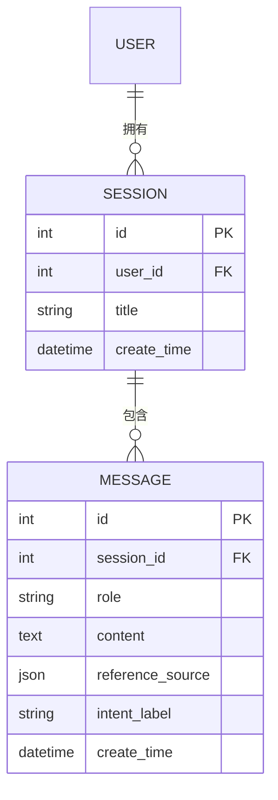

# 数据模型：会话与消息

**日期**：2026-08-29 | **特性**：[spec.md](spec.md)

本特性拥有并操作 Session、Message 实体（与 001 数据模型中的同名实体为同一表，本特性负责 CRUD/查询，001 负责问答时写入）。

## 实体总览



## 1. Session（会话）

| 字段 | 类型 | 约束 | 说明 |
|---|---|---|---|
| id | BIGINT | PK, AUTO_INCREMENT | 会话 ID |
| user_id | BIGINT | NOT NULL, FK → user.id | 归属用户（数据隔离依据） |
| title | VARCHAR(100) | NOT NULL | 会话标题（「新会话」或首问摘要，见 research §1） |
| create_time | DATETIME | NOT NULL, DEFAULT CURRENT_TIMESTAMP | 创建时间 |

**索引**：`(user_id, create_time DESC)` 支持「按用户倒序列表」查询（FR-002）。

**标题规则**：创建时默认「新会话」；首条用户消息后若仍为默认值，更新为「前 20 字符 + …」摘要。

## 2. Message（消息）

| 字段 | 类型 | 约束 | 说明 |
|---|---|---|---|
| id | BIGINT | PK, AUTO_INCREMENT | 消息 ID |
| session_id | BIGINT | NOT NULL, FK → session.id | 所属会话 |
| role | ENUM('user','ai') | NOT NULL | 消息角色 |
| content | TEXT | NOT NULL | 消息正文 |
| reference_source | JSON | NULL | AI 回答引用来源数组（用户消息为 NULL；兜底回答为空数组，见 FR-007 兼容） |
| intent_label | VARCHAR(50) | NULL | 意图标签（001 预留字段，本特性透传展示） |
| create_time | DATETIME | NOT NULL, DEFAULT CURRENT_TIMESTAMP | 创建时间 |

**索引**：`(session_id, create_time, id)` 支持历史消息稳定有序分页（FR-003/FR-009）。

**reference_source 结构**（与 001 契约一致）：
```json
[ { "doc_name": "FAQ.md", "snippet": "退货时限为 7 天……" } ]
```

**写入边界**：Message 仅由 001 问答链路在流结束后写入（user + ai 各一条，ai 带 reference_source）；本特性只读查询，保证单一写入方、无竞态。

## 查询契约

| 场景 | 查询 | 说明 |
|---|---|---|
| 会话列表（FR-002） | `WHERE user_id=:uid ORDER BY create_time DESC LIMIT/OFFSET` | 分页，`page_size` 默认 20 |
| 会话详情归属（FR-004） | 按 id 查 Session，断言 `user_id==uid` | 不满足拒绝 |
| 历史消息（FR-003/FR-009） | `WHERE session_id=:sid AND (create_time,id) > cursor ORDER BY create_time ASC, id ASC` | 游标/偏移分页，`page_size` 默认 20 上限 100 |
| 最近 N 轮（FR-008） | `WHERE session_id=:sid ORDER BY create_time DESC LIMIT N` 再倒序 | 供 001 多轮上下文 |

## 校验规则（来自规格需求）

| 规则 | 来源 | 实现 |
|---|---|---|
| 未登录不能创建/查看会话 | FR-001/FR-002 | `get_current_user` 鉴权依赖（003） |
| 仅展示自己会话、倒序 | FR-002/SC-002 | 列表 owner 过滤 + `create_time DESC` |
| 历史消息按时间顺序 | FR-003/SC-003 | `(create_time, id)` 复合排序 |
| 数据隔离，越权拒绝 | FR-004/SC-005 | 列表过滤 + 详情归属断言 |
| 消息量大分页承载 | FR-009 | 分页参数（默认 20，上限 100） |
