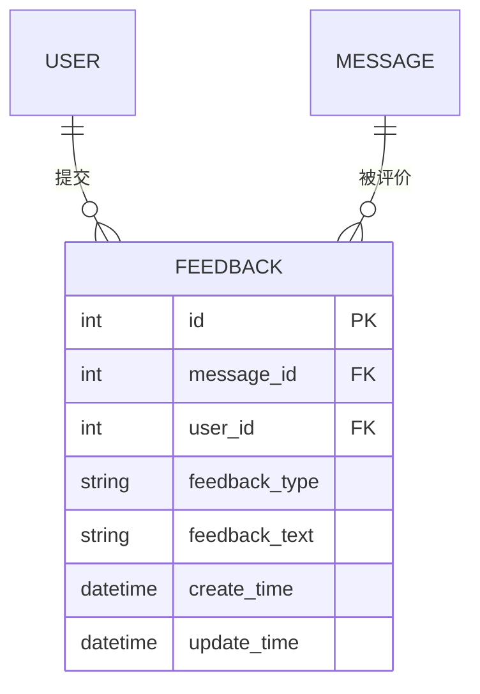

# 数据模型：用户反馈

**日期**：2026-08-29 | **特性**：[spec.md](spec.md)

本特性拥有并操作 Feedback 实体。消息/会话实体由 004 提供，本特性通过 message_id 关联校验。

## 实体总览



## 1. Feedback（反馈）

| 字段 | 类型 | 约束 | 说明 |
|---|---|---|---|
| id | BIGINT | PK, AUTO_INCREMENT | 反馈 ID |
| message_id | BIGINT | NOT NULL, FK → message.id（**不级联删除**） | 被反馈的 AI 消息 |
| user_id | BIGINT | NOT NULL, FK → user.id | 提交者（不支持匿名） |
| feedback_type | ENUM('like','dislike') | NOT NULL | 反馈类型：点赞 / 踩（二选一） |
| feedback_text | VARCHAR(500) | NULL | 可选文字说明（≤200 字默认，存储按字符计） |
| create_time | DATETIME | NOT NULL, DEFAULT CURRENT_TIMESTAMP | 首次提交时间 |
| update_time | DATETIME | NOT NULL, DEFAULT CURRENT_TIMESTAMP ON UPDATE | 最近更新时间 |

**唯一约束**：`UNIQUE(message_id, user_id)` — 一条消息同一提交者仅一条记录（规格假设），重复提交 upsert 覆盖（FR-006）。

**外键策略**：`message_id` 外键**不启用** `ON DELETE CASCADE`；消息/会话删除时反馈独立保留，供统计（FR-005 / 假设「反馈数据保留」）。

## 提交语义（upsert）

```text
用户提交 (message_id, feedback_type, feedback_text?)
    │
    ├─ 校验：消息存在 / 归属当前用户 / role='ai' / 类型必选 / 文字≤上限
    │
    └─ UPSERT：命中 UNIQUE(message_id, user_id) → 更新 type/text/update_time
                未命中 → 插入新记录
```

重复提交以最后一次为准（research §1）。

## 校验规则（来自规格需求）

| 规则 | 来源 | 实现 |
|---|---|---|
| 仅登录用户可提交 | FR-001 | `get_current_user` 鉴权依赖（003） |
| 仅 AI 回答可反馈 | FR-003/SC-003 | 消息 role 断言，用户消息 400 |
| 消息必须存在 | FR-003 | 不存在返回 404 |
| 越权反馈拒绝 | FR-009/SC-006 | 消息归属断言（004 逻辑复用） |
| 必须至少选一种类型 | FR-008/SC-006 | `feedback_type` 必填枚举 |
| 文字 ≤200 字（可配置） | FR-007 | 长度校验，恰好 200 通过 |
| 重复提交覆盖更新 | FR-006/SC-004 | UNIQUE + upsert |
