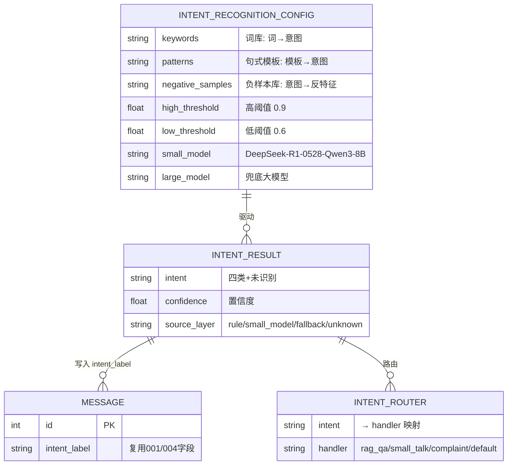

# 数据模型：意图识别（三层漏斗）

**日期**：2026-08-29 | **特性**：[spec.md](spec.md)

本特性**不新增业务表**。数据面由三类构成：① 复用 001/004 的 `message.intent_label` 字段（写入消费）；② 运行时识别结果 `IntentResult`（进程内传输对象，不落库）；③ 可配置数据（词库/句式模板/负样本库/双阈值/模型配置）。

## 实体总览



## 1. IntentCategory（意图枚举，代码常量，非表）

识别链路的最终输出域，同时是词库、句式模板、负样本库、Few-shot 样例的组织维度。

| 枚举值 | 意图 | 说明 |
|---|---|---|
| `product_consult` | 产品咨询 | 产品功能/使用方法/价格/参数等咨询 |
| `after_sale` | 售后 | 退换货、维修、售后政策等 |
| `small_talk` | 闲聊 | 打招呼/感谢/非业务话题 |
| `complaint` | 投诉 | 不满、投诉、要求转人工 |
| `unknown` | 未识别 | 模型不可用/低置信度兜底/解析失败降级 |

## 2. IntentResult（识别结果，进程内传输对象）

一次识别流程的产出，携带完整溯源信息，供路由与入库使用；**不落库**（`message.intent_label` 只持久化意图枚举值）。

| 属性 | 类型 | 说明 |
|---|---|---|
| intent | IntentCategory | 最终意图；`unknown` 为降级值 |
| confidence | float (0~1) | 最终置信度（规则层=1.0；模型层=模型自报/一致性结果） |
| source_layer | enum(rule/small_model/fallback/unknown) | 产出层：规则层/小模型层/大模型层/降级 |
| raw_query | str | 原始用户输入（保留展示与入库） |
| normalized_query | str | 归一化后输入（仅规则层使用） |
| matched_patterns | list[str] | 命中的关键词/句式（规则层溯源，调试用） |
| clarification_question | str \| null | 中段置信度触发澄清反问时的追问文本 |

**生命周期**：`recognize(query)` 返回后即被路由消费，过程对象销毁；意图值写入消息意图标签。

## 3. IntentRecognitionConfig（识别配置，三层存储）

无独立表，按敏感度分三层存储（research §9）。词库/句式模板/负样本库为 YAML/JSON 文件，阈值与重试参数落 `system_config` 表，密钥类落 `.env`。

**词库 `keywords`（词 → 意图）**——AC 自动机匹配输入：

```yaml
# intent_keywords.yaml（示例）
product_consult: ["价格", "多少钱", "怎么用", "功能介绍", "参数"]
after_sale: ["退货", "退款", "换货", "维修", "售后"]
small_talk: ["你好", "谢谢", "在吗", "再见"]
complaint: ["投诉", "差评", "太差", "态度差", "赔偿"]
```

**句式模板 `patterns`（模板 → 意图）**——pyparsing 文法解析：

```yaml
# intent_patterns.yaml（示例）
after_sale: ["帮我查询(?P<subject>退款|退货|订单)", "取消订单(?P<order_id>.+)"]
product_consult: ["帮我查一下(?P<subject>功能|价格).*"]
```

**负样本库 `negative_samples`（意图 → 反特征）**——反向校准拦截：

```yaml
# intent_negative_samples.yaml（示例）
complaint:
  - "投诉咨询中心"          # 含"投诉"但为机构名，非投诉意图
  - "投诉电话多少"          # 实为咨询投诉渠道
after_sale:
  - "退货政策是什么"        # 咨询而非办理退换货
```

**阈值与参数（`system_config` 表，可热调）**：

| 配置项 key | 默认值 | 说明 | 对应 |
|---|---|---|---|
| `intent_high_threshold` | 0.9 | 高阈值：≥ 直接输出 | FR-008 / SC-002 |
| `intent_low_threshold` | 0.6 | 低阈值：< 流转大模型 | FR-008 / SC-004 |
| `intent_clarify_retry` | 1 | 中段置信度澄清后的重试次数 | FR-008 |
| `intent_reverse_calibrate` | true | 反向校准特征规则通道开关 | FR-007 |
| `intent_model_self_check` | false | 反向校准模型自评通道开关（增本） | FR-007 |

**密钥与模型（`.env`，禁止硬编码，`.env.example` 提供占位）**：

| 变量 | 占位 | 说明 |
|---|---|---|
| `DEEPSEEK_API_KEY` | 用户填写 | 兜底层模型 API 密钥 |
| `DEEPSEEK_BASE_URL` | 用户填写 | 兜底层 OpenAI 兼容 base_url（官方或自建 vLLM/第三方平台） |
| `SMALL_MODEL_NAME` | 用户填写 | 小模型层模型名（独立厂商/端点，如 `Qwen/Qwen3-8B`） |
| `SMALL_MODEL_API_KEY` | 用户填写 | 小模型层 API 密钥（**不复用 DeepSeek 凭据**） |
| `SMALL_MODEL_BASE_URL` | 用户填写 | 小模型层 OpenAI 兼容 base_url |
| `DEEPSEEK_LARGE_MODEL` | 用户填写 | 大模型兜底模型名（复用上方 DEEPSEEK 凭据；空则回退 `DEEPSEEK_CHAT_MODEL`） |

> **成本统计**：每次模型调用把 `usage`（prompt/completion/total/reasoning tokens）连同 model、时间戳、所属漏斗层（small_model/fallback）写入统计，用于量化三层漏斗各层成本占比（research §6.1）。

## 4. IntentRouter（意图 → Handler 映射，代码常量 + 依赖注入）

| 意图 | HandlerKey | 行为 |
|---|---|---|
| product_consult | `rag_qa` | 走 001 RAG 问答链路 |
| after_sale | `rag_qa` | 走 001 RAG 问答链路（检索售后政策知识） |
| small_talk | `small_talk` | 模板/轻量友好回复，**不检索知识库** |
| complaint | `complaint` | 转人工客服提示 + 留档 |
| unknown | `default` | 走 001 正常问答或兜底话术，不阻断主流程 |

## 校验规则（来自规格需求）

| 规则 | 来源 | 实现 |
|---|---|---|
| 规则层匹配前文本归一化 | FR-001 | normalize.py（全角/符号/繁简/形近） |
| 关键词最长匹配 + 词边界 | FR-002/FR-003 | ac_automaton.py（ahocorasick-ng 最长匹配 + 词边界薄校验） |
| 句式模板匹配固定句式 | FR-004 | template_patterns.py（pyparsing 文法解析） |
| 规则层命中不调用模型 | FR-005 | service.py 命中即短路返回 |
| 高/低双阈值判定 | FR-008 | threshold.py |
| 反向校准负样本拦截 | FR-007 | calibrate.py |
| 大模型强制 JSON 输出 | FR-010 | fallback/client.py 强制解析，失败降级 unknown |
| 闲聊/投诉不检索知识库 | FR-012 | router.py 映射 + 集成点短路 |
| 密钥经环境变量、禁止硬编码 | FR-014 | .env + .env.example |

## 状态流转

意图识别为**流水线**而非状态机，单次输入沿三层漏斗单向流转，短路即止：

```text
用户输入 → 文本归一化
        → 规则层：关键词命中 或 句式命中 → 输出意图（source=rule）→ 路由 → 终止
        → 小模型层：置信度 ≥ 高阈值 → 输出（source=small_model）
                    └ 低阈值 ≤ 置信度 < 高阈值 → 反问澄清 → 重判 → 仍不达标则下一步
                    └ 置信度 < 低阈值 或 反向校准拒绝 → 放弃
        → 大模型层：Few-shot + JSON → 解析成功 → 输出（source=fallback）
                    └ 解析失败/超时/429 → 降级 unknown（source=unknown）
        → 路由：产品咨询/售后→rag_qa；闲聊→small_talk；投诉→complaint；unknown→default
```
