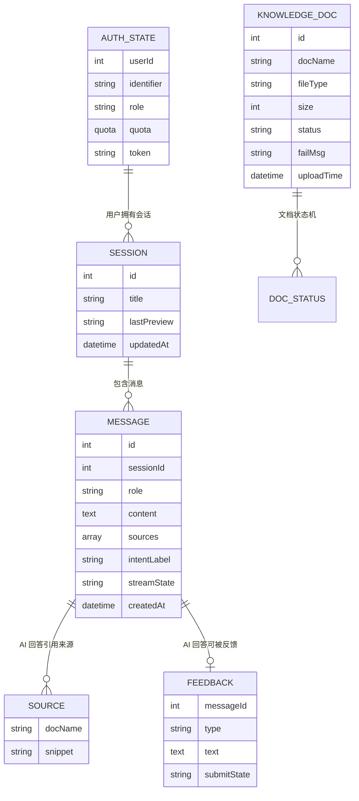

# 数据模型：前端页面设计

**日期**：2026-08-29 | **特性**：[spec.md](spec.md)

本文件定义前端侧的**视图模型（view-model）与状态模型**。前端不拥有持久化数据：所有实体均由后端（001–005 特性）存储，前端仅在内存态（TanStack Query 缓存 + Zustand 全局态）中镜像展示所需字段，并以下列结构驱动页面渲染。SSE 事件结构为前端与后端问答流之间的消费契约（经 `@microsoft/fetch-event-source` 消费，解析零自研）。

## 实体总览



## 1. AuthState（登录态，Zustand `stores/auth.ts`）

来自 003 鉴权契约的 `GET /api/auth/me` 与登录响应，前端只读镜像。

| 字段 | 类型 | 说明 |
|---|---|---|
| userId | number | 用户 ID |
| identifier | string | 手机号或邮箱（脱敏展示） |
| role | 'user' \| 'admin' | 角色；管理端路由要求 admin |
| quota | { limit, used, remaining } | 当日提问配额（FR-016 次数提示用） |
| token | string \| null | JWT，仅经 `authTokenStore` 抽象读写（v1 sessionStorage），不进入组件 |

**状态流转**：`未登录 → 登录中 → 已登录`；任一 API 返回 401 → 清空回「未登录」并跳登录页（FR-010/FR-011）。

## 2. Session（会话，Zustand `stores/session.ts` + TanStack Query 会话列表）

| 字段 | 类型 | 说明 |
|---|---|---|
| id | number | 会话 ID |
| title | string | 会话标题（展示、可重命名） |
| lastPreview | string | 最后消息预览（列表展示 FR-022） |
| updatedAt | datetime | 更新时间（列表排序） |
| isActive | boolean | 当前激活态（列表高亮 FR-022） |

**状态流转**：`加载中 → 已加载 | 加载失败`；`新建 → 空会话激活`；`切换 → 历史加载中 → 已加载`。切换会话时加载该会话全部历史消息（FR-024）。

## 3. Message（消息，TanStack Query 历史 + `useChatStream` 流式消息）

每条消息为独立对象，驱动问答主界面渲染（FR-012 视觉区分、FR-013 流式、FR-015 来源）。

| 字段 | 类型 | 说明 |
|---|---|---|
| id | number | 服务端消息 ID（AI 回答在 `finish` 事件后回填） |
| sessionId | number | 所属会话 |
| role | 'user' \| 'ai' | 消息角色；反馈控件仅挂 ai（FR-029） |
| content | string | 展示文本（AI 回答流式追加） |
| sources | Source[] | 引用来源（文档名 + 片段摘要），来自 `meta` 事件（FR-015） |
| intentLabel | string \| null | 意图标签（可选特性，FR-020） |
| suggestions | string[] | 追问建议（可选特性，FR-021） |
| streamState | StreamState | 流式状态机（见下） |
| createdAt | datetime | 消息时间 |

**StreamState（流式状态机）**：该状态为应用层消息跟踪（`useChatStream` hook 持有，底层经 fetch-event-source 回调驱动），**SSE 解析由库完成、本状态仅消费事件不重造解析**：

```text
       用户发送
          │
          ▼
      connecting ──meta/data──▶ streaming ──finish──▶ completed
          │                        │  ▲                    │
          │                        │  └─error/abort──┐     │
          ▼                        ▼                 ▼     ▼
      error（连接失败）          error（中断）      aborted      completed（有引用）
```

- `connecting`：请求已发出，等待首事件
- `streaming`：正在流式接收 token（UI 显示「生成中」+ 停止按钮）
- `completed`：收到 `finish`，渲染定格（来源/追问建议随 `finish` 一并落地）
- `aborted`：用户停止（保留已生成内容 FR-014）
- `error`：收到 `error` 事件或网络中断（保留已生成内容 + 可重试 FR-019）

**Source 结构**（对应 SSE `meta` 事件）：
```json
{ "docName": "产品介绍.txt", "snippet": "本产品支持在线客服功能……" }
```

## 4. Feedback（反馈，TanStack Query `useMutation` 乐观提交）

| 字段 | 类型 | 说明 |
|---|---|---|
| messageId | number | 被反馈的 AI 消息 ID（唯一） |
| type | 'up' \| 'down' | 赞 / 踩 |
| text | string | 可选文字反馈（踩时可填 FR-027） |
| submitState | 'idle' \| 'submitting' \| 'done' | 提交状态，防重复（FR-030） |

**状态流转**：`idle → submitting → done`；乐观更新立即切换 UI，失败回滚回 `idle` 并提示（research §8）；重进会话以服务端返回状态为准（FR-028）。

## 5. KnowledgeDoc（知识库文档，TanStack Query 列表 + AntD Upload 上传）

| 字段 | 类型 | 说明 |
|---|---|---|
| id | number | 文档 ID |
| docName | string | 文档名（搜索/展示/重命名 FR-032/036） |
| fileType | '.txt' \| '.md' \| '.pdf' | 类型（上传白名单 FR-033） |
| size | number | 大小（字节） |
| status | '处理中' \| '就绪' \| '失败' | 状态（FR-032/034） |
| failMsg | string \| null | 失败原因（状态「失败」时展示 FR-034） |
| uploadTime | datetime | 上传时间（列表排序） |

**状态流转（服务端异步驱动，前端轮询感知）**：

```text
上传提交 ──▶ 处理中 ──▶ 就绪
                 └──▶ 失败（展示 failMsg，可重传）
```

前端仅在前端内存维护临时 `上传中` 项（进度），服务端确认后转入正式列表「处理中」，此后由轮询（仅存在非终态项时开启）推进到「就绪/失败」。

## 6. SSE 事件契约（`api/sse.ts` 经 @microsoft/fetch-event-source 消费）

| 事件 | 前端处理 |
|---|---|
| `meta` | 写入当前 AI 消息 `sources`（FR-015） |
| `data` | 追加当前 AI 消息 `content`，触发 rAF 节流渲染（FR-013） |
| `finish` | 回填 `messageId`、落定 `suggestions`，状态 → `completed` |
| `error` | 按错误码提示（超时/限流/服务异常），状态 → `error`，保留已生成内容（FR-019） |

## 校验规则（来自规格需求，前端前置 + 后端兜底）

| 规则 | 来源 | 前端实现 |
|---|---|---|
| 手机号/邮箱格式、密码长度、两次密码一致 | FR-008 | `utils/validation.ts` 内联校验 |
| 单条问题 ≤500 字，超长禁止发送 | FR-016 | 输入区实时计数 + 超长拦截 |
| 上传类型 ∈ {.txt,.md,.pdf} 与大小上限 | FR-033 | 选择文件时前置校验 |
| 未登录访问受保护页重定向 | FR-011 | 路由守卫 + 401 拦截 |
| 管理端仅 admin 可见 | FR-031 | 路由守卫 `adminOnly` |
