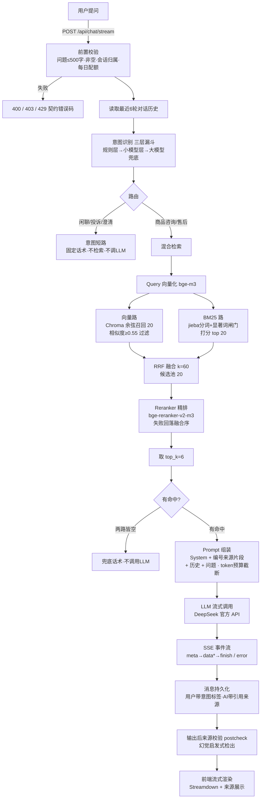

# 项目说明：AI 智能客服系统（Nexus-Support-Agent）

> 本文档以**当前代码实现为基准**（2026-09），说明技术选型及原因、整体 AI 架构（RAG 链路）、
> AI 特有工程问题的处理思路、使用到的 AI 工具清单，以及使用 AI 编程工具的心得。

| 文档 | 定位 |
| --- | --- |
| 本文档 | 项目总览：技术选型 / 架构图 / 工程问题 / AI 工具体会 |
| [运行指南.md](运行指南.md) | 如何跑起来（前端 + 后端 + 模型/API 配置） |
| [docs/AI架构设计.md](docs/AI架构设计.md) | 001 RAG 检索链路详细设计与关键决策 |
| [docs/API文档.md](docs/API文档.md) | 各模块接口契约 |
| [specs/](specs/) | 各模块规格（spec / plan / tasks / research） |

---

## 一、技术选型及原因

### 1.1 对话 LLM：DeepSeek 官方 API（`deepseek-v4-flash`）

- **方案**：`LLM_BACKEND=deepseek`，`LLM_MODEL=deepseek-v4-flash`，`LLM_BASE_URL=https://api.deepseek.com`，OpenAI 兼容 `/chat/completions` + SSE 流式，用 `httpx` 异步直连（见 `app/services/rag/llm.py`）。
- **为什么选它**：
  1. **中文能力强**：客服场景以中文口语为主，DeepSeek 中文理解与生成质量处于第一梯队，对知识库书面表述与口语提问的语义映射更好。
  2. **成本低、够用**：`flash` 档追求首字延迟与性价比，问答链路对深度推理要求不高。
  3. **OpenAI 兼容协议 + 流式**：异步 `httpx` 逐块读取 SSE 即可产出 token，不引入厚重 SDK，与 FastAPI 原生 `async` 契合；兼容协议让「切换厂商」只需换 `base_url` / `model` / `key`。
  4. **一份密钥复用**：001 对话与 006 意图大模型兜底层共用 `DEEPSEEK_API_KEY`，鉴权统一。
  5. **可插拔降级**：`LLM_BACKEND` 可切 `ollama`（本地 `qwen2`），沙箱/离线也能跑。
- 对比过：本地 Ollama → 免 Key 但中文与生成质量弱于云端 DeepSeek，留作离线兜底。

### 1.2 Embedding：SiliconFlow 云端 bge-m3（`BAAI/bge-m3`，1024 维）

- **方案**：`EMBEDDING_BACKEND=openai_compat`，走 SiliconFlow `/embeddings`（OpenAI 兼容），模型 `BAAI/bge-m3`（见 `app/services/embedding.py`）。
- **为什么选它**：
  1. **bge-m3 中文检索效果好**：面向中文知识库（Markdown 业务文档）检索精度高，1024 维在精度/成本之间平衡。
  2. **云端零本地内存**：本机内存紧张，本地加载 bge-m3 实测 OOM；云端 API 零内存占用，硅基流动免费额度足够 demo。
  3. **Query 与入库共用同一封装**（`embed_texts`）→ 检索与索引向量空间严格对齐，避免「Query/文档用不同模型」导致向量空间错位的经典坑。
  4. **可插拔**：可切 `local`（sentence-transformers）/ `ollama`（本机 bge-m3），适应不同部署环境。
- 对比过：OpenAI text-embedding-3（需外网、违背本地沙箱）、本地 bge-m3（OOM）。

### 1.3 向量库：Chroma（本地文件模式）

- **方案**：`chromadb.PersistentClient(path=./chroma_data)`，collection 使用 `hnsw:space=cosine`，封装收敛在 `app/vector_store/chroma.py` 单点。
- **为什么选它**：
  1. **零部署**：纯本地文件持久化，无需额外服务进程——相比 Milvus / Qdrant 需单独部署，本地沙箱即可运行。
  2. **支持 metadata 过滤与持久化**：检索时按「就绪文档集合」`where={"doc_id": {"$in": [...]}}` 过滤，切片元数据（来源、章节、版本）可支撑后续扩展。
  3. **职责分离**：MySQL 存业务数据（文档/切片/会话/用户/配额），Chroma 只存「切片文本 + 向量 + 检索用元数据」，各司其职。
  4. **可替换**：切换生产向量库（Qdrant / Milvus / pgvector）只改 `chroma.py` 一个文件。

### 1.4 检索链路：混合检索（向量 + BM25 双路召回 → RRF 融合 → Reranker 精排）

| 环节 | 方案 | 原因 |
| --- | --- | --- |
| 向量路 | Chroma 余弦召回 `candidate_k=20`，相似度 ≥ `0.55` 过滤 | 语义召回；阈值过滤低相关片段 |
| BM25 路 | jieba 分词 + **自研 Okapi BM25**（k1=1.5, b=0.75）+ **显著词闸门**，召回 `top 20` | 补精确关键词匹配（品牌/型号/货号）；显著词闸门防功能字假阳性 |
| 融合 | RRF：`Σ 1/(k+rank)`，`k=60` | 只依赖排名、免分数归一化，两路命中者自然排前 |
| 精排 | bge-reranker-v2-m3 Cross-Encoder（可选，`rag_reranker_enabled`） | 把「语义相似但业务无关」的片段压后，降低上下文注意力稀释 |
| 输出 | 取 `top_k=6` 送 LLM | 控制注入片段量 |

- **为什么混合检索**：纯向量对口语化表述与关键词精确匹配召回不足；纯 BM25 对「语义相关但无字面重叠」漏召回。双路互补后 RRF 融合（详见 [docs/AI架构设计.md](docs/AI架构设计.md) 关键决策 §1）。
- **为什么自研 BM25**：jieba 仅承担分词，打分自研——满足项目约束「核心链路自研可读、可调优」，不引入 `jieba-bm25` 第三方打分包。
- **Reranker 全链路可降级**：未装 `sentence-transformers`（`find_spec` 检测）→ Noop 保序；加载失败 → 启动 `warmup()` 吞异常置 Noop；推理异常 → `retriever` try/except 回落 RRF 融合序。**任何一环失败都不影响主链路可用性**。

### 1.5 其余技术栈

- **后端**：Python 3.14 + FastAPI —— 异步原生，对 SSE 流式输出友好；`BackgroundTasks` 进程内执行知识库后台任务，**无需 Redis / Celery**。
- **数据**：SQLAlchemy + pymysql（MySQL 8.0），业务数据 + `system_config` 运行时热调参数（如 `rag_top_k` / 意图阈值，见 `app/config.py` 与 `app/services/config_service.py`）。
- **前端**：React 18 + TypeScript + Vite + Ant Design 5；SSE 用 `@microsoft/fetch-event-source`，流式 Markdown 用 Streamdown；**前端不调用任何模型/检索，LLM 与检索全部由后端完成（API Key 只存服务端环境变量）**。

---

## 二、整体 AI 架构图（RAG 链路）

从用户提问到返回答案的完整链路（对应 `app/api/chat.py` 的编排）：



### 分步说明

1. **入口**：前端经 SSE 调用 `POST /api/chat/stream`。
2. **前置校验**：问题非空且 ≤500 字（400）；会话归属校验（403）；每日配额校验 + **原子递增**（429，见 `app/services/validation.py`）。
3. **历史读取**：取该会话最近 `context_turns=6` 条消息，时间正序注入。
4. **意图识别**（三层漏斗，`app/intent/service.py`，**永不抛异常**）：
   - 规则层（`pyahocorasick` 多模式 + `pyparsing` 句式模板 + YAML 词库）命中即短路，零模型；
   - 未命中 → 小模型层（独立 `SMALL_MODEL_*` 端点），高阈值（≥0.9）采纳、低阈值（<0.6）放弃、中段重判，重判仍中段输出澄清反问；
   - 仍无 → 大模型兜底（复用 DeepSeek）；任一模型失败一律降级 `unknown`，不阻断主链路。
5. **意图路由**（`app/intent/router.py`）：闲聊 / 投诉 / 澄清 → **不检索、不调 LLM**，固定话术短路；商品咨询 / 售后 → 走 RAG 主链路。
6. **混合检索**（`app/services/rag/retriever.py`，见上文 1.4）：仅召回「就绪」文档的切片；两路皆空 → 空列表。
7. **空检索兜底**：不调用 LLM，直接返回固定话术（见三 §3.1）。
8. **Prompt 组装**（`app/services/rag/prompt.py`）：`System Prompt`（强约束依据编号材料）+ 编号来源片段（`【1】来源：xxx｜片段：xxx`）+ 历史 + 当前问题；超预算按降级顺序截断（见三 §3.2）。
9. **LLM 流式**（`app/services/rag/llm.py`）：异步 httpx 逐块读取，异常映射为 `llm_timeout` / `llm_rate_limited` / `llm_error`。
10. **SSE 事件序列**（`app/services/rag/sse.py`）：`meta`（引用来源，去重）→ `data*`（增量 token）→ `finish`（`message_id` + `postcheck`）或 `error`。
11. **持久化 + 后校验**：用户消息落库（附意图标签），AI 消息落库（附 `reference_source`）；完整输出后做来源校验（见三 §3.3），结果随 `finish` 提示前端，不阻断回答。

---

## 三、业务思考：AI 特有工程问题的处理（重点）

RAG 系统不是「把问题丢给 LLM」那么简单，准确度问题贯穿**索引层 → 检索层 → 生成层**。以下按本项目实际实现逐一说明。

### 3.1 检索为空（Retrieval Empty）——「不知道」比「乱编」好

**问题**：知识库没有与问题匹配的内容，或用户问的是库外问题（新政策、私密业务、闲聊）。此时若照常调用 LLM，模型会用「训练时学到的大众知识」编一个听上去合理但错误的答案——这正是 RAG 要消除的幻觉源头之一。

**本项目实现**（`app/api/chat.py` `empty_retrieval` 分支 + `retriever.py`）：
- 两路召回（向量 + BM25）经 RRF 融合后**候选池为空**，即判定「检索为空」，**直接短路，不调用 LLM**。
- 返回固定兜底话术：`抱歉，知识库中没有找到相关信息，请换个方式提问或者联系人工客服。`，并照常持久化、照常发 `finish`，前端正常收尾。
- **不**用 LLM 的「通用知识」补答，从源头杜绝无据编造。

**配套的检索侧防误判**：
- **向量阈值**（相似度 ≥ 0.55）：过滤掉低相关的「勉强沾边」片段，避免把噪声当命中。
- **BM25 显著词闸门**（`app/services/rag/bm25.py`）：候选片段须与问题共享 ≥1 个「显著词」（CJK 二元及以上 / ASCII 词 len≥2）。解决「今天的天气怎么样」因共享功能字「的/天/么」命中无关文档、**破坏空检索兜底语义**的问题——闸门保证「看起来命中」是真命中。

**后续可拓展**：
- **RAG query 结构化构造**：口语「退款到了吗」与文档书面语「退款时效」语义错位，直接检索效果差。可按「意图 + 槽位」映射为业务检索词（如 `退货退款 → "退款时效 原路退款"`），提升召回质量。
- **Query 重写 / HyDE**：先用 LLM 把口语问题改写/扩写为更贴近知识库表述再检索。
- **追问澄清**：检索为空时根据已识别意图反问用户细化（如「请问是哪个订单？」，已具备澄清路由，可复用到检索层）。

### 3.2 上下文超长（Context Overflow）——「知识」比「历史」优先

**问题**：Context Window 有限。System Prompt + 知识片段 + 多轮历史 + 当前问题可能超限。怎么压缩而不损失回答依据，是 RAG 工程的核心取舍。

**上下文爆炸核心根因**：大模型无状态 + Agent 框架默认只追加不清理 + 工具/子 Agent 返回数据多 + 无效日志堆积 → Token 持续增长爆炸。
**本项目实现**（`app/services/rag/prompt.py`）：
- **Token 预算**：`context_max_tokens=6000`，按 `~1.5 字符/token`（保守值）估算字符预算。
- **降级顺序（有优先级，行为可预期）**：
  1. **先按消息边界丢最早历史**（不按字符硬切，保留整句语义；最坏保留一条最近历史）；
  2. **仍超再减知识片段**（从末尾减，保持编号 `【1】【2】…` 连续）；
  3. **严禁先丢知识**——知识片段是答案依据，历史只是辅助语境。
- 知识片段**带编号 + 来源元信息**注入，让模型可引用、可追溯；这一格式同时是幻觉抑制的一部分。

**后续可拓展**：

**分层治理策略**（按优先级从源头发力）：

#### 前置拦截（源头控制）
- **工具返回裁剪**：大文本不做透传，提取结构化字段；超长正文用「内容已归档占位符」替换，原始数据落盘。
- **子 Agent 结果限制**：只返回固定结构体，报错仅返回错误原因，避免递归式爆炸。
- **记忆召回管控**：数量限制 + 相似度去重 + 分区 Token 预算，提前卡死各模块上限。

#### 运行期无损清理（零幻觉）
每轮任务闭环后按三规则过滤：**消息类型**、**任务状态**、**生命周期**：
- 已完成子任务的报错日志
- 失败试错的 thought 过程
- 过期工具原始结果
→ 直接从活跃窗口剔除，不调用大模型。

#### 双水位可控滚动摘要（防暴力截断）
基于模型最大上下文窗口设置 **70% 软水位**、**90% 硬水位**（实时统计有效 Token，非估算）：

| 水位 | 触发机制 |
| --- | --- |
| **软水位 (70%)** | 滚动压缩：近期多轮消息完整保留，远期历史调大模型摘要替换 |
| **硬水位 (90%)** | ①暂停新增量（工具返回/记忆召回）；②强制冷热迁移（筛选已闭环轨迹/过期数据/无效日志/低相关消息，迁出至 Redis/DB/向量库）；③对必要远期历史做高强度 LLM 压缩；④严格保留核心内容（用户主需求/当前任务/成对工具调用）|

#### 架构冷热分离（收敛活跃窗口）
- **热记忆**（活跃工作记忆）：当前执行任务 + 必需交互信息 → 喂给大模型
- **冷记忆**（降级归档）：已完成子任务 + 过期中间结果 → Redis/MySQL（会话级）+ 向量长期记忆（远期知识）
- **降级策略**：子任务闭环 / 轮数 TTL / 相关性打分三判定

#### 底层硬兜底（最终防护）
- **Token 硬上限**：防止上层异常导致无限追加
- **内容分级保护**：
  - ✅ **不可压缩**：系统 Prompt、用户主需求、当前任务信息
  - ⚠️ **可压缩**：历史对话、工具返回、召回记忆

**调试与监控**：实时 Token 水位日志打印、阈值灰度调参、压缩前后效果校验、线上膨胀速率观测，动态微调适配不同任务。

**整体思路**：源头拦截 → 无损清理 → 超水位压缩 → 冷热隔离 → 硬兜底，彻底解决 Agent 循环拼接、工具透传、子任务递归、无效日志堆积导致的上下文爆炸。

### 3.3 LLM 幻觉（Hallucination）——三层防线 + 一处启发式校验

**问题**：LLM 会生成「看似合理但无依据」的内容，客服场景直接导致用户投诉。

**本项目实现（三层防线）**：

| 防线 | 机制 | 代码位置 |
| --- | --- | --- |
| ① 源头约束 | System Prompt 强约束：**「必须严格依据下面编号的知识片段，禁止使用片段之外的任何信息编造内容；若片段不足以回答，请明确告知无法回答」** | `prompt.py` `SYSTEM_PROMPT` |
| ② 空检索短路 | 无命中就不调 LLM，从源头消灭「无米之炊式幻觉」（见 3.1） | `chat.py` |
| ③ 输出后来源校验 | 完整输出后启发式校验：按句切分，对长度 ≥20 字的**长断言**，计算其与全部知识片段的**字符二元组重叠率**；重叠率 <10% 判定「超出知识库范围」，标记 `status=review`（待人工核实），经 `finish` 事件携带 `postcheck` 提示前端 | `postcheck.py` |

**配套增强幻觉抑制**：
- 知识片段**编号 + 来源 + 章节**注入，模型回答时可引用，前端 `meta` 事件展示「依据」让用户自行判断。
- Reranker 精排剔除「语义相似但业务无关」的片段，降低无关信息混入上下文导致的注意力稀释与幻觉。
- 错误路径也**持久化友好话术**（超时/限流/不可用），不发空响应、不静默结束（`chat.py` `LLM_ERROR_TEXT`）。

**后续可拓展**：
- **知识冲突检测与过滤**：同一业务概念检索到新旧版本矛盾片段时，**先按 `version_date`（时间优先）与 `source_priority`（来源优先级）过滤，只把胜出者注入**，而不是把矛盾信息丢给 LLM 自行取舍（LLM 会折中编造）。本项目**元数据已预留** `version_date / source_priority / category / heading_path`（`ingester.py` / `chroma.py`），冲突检测模块是明确的下一步。
- **二次 LLM 校验**：对低置信度回答再用 LLM 复核是否严格依据材料（成本高，作为 postcheck 的补充）。
- **检索质量评测闭环**：人工标注 50-100 个 QA 对 → 自动跑 `Hit Rate@k / Recall@k / MRR` → bad case 分析（分块/检索/排序/冲突/多跳五类根因）→ 针对性优化 → 重测。量化评测是判断「变好了还是变差了」的唯一依据。

### 3.4 其它 AI 工程问题

| 问题 | 本项目处理 |
| --- | --- |
| **模型异常**（超时/限流/断连） | 统一映射 `LLMTimeoutError / LLMRateLimitError / LLMConnectionError` → SSE `error` 事件 + 友好文案 + 消息持久化，不发空响应、不静默结束（`llm.py` + `chat.py`）。整体超时 60s、首 token 30s。 |
| **Embedding 不可用** | 批量调用有限重试（`embedding_retry_times`，线性退避）；重试耗尽上抛，文档处理标记失败并整份回滚（`embedding.py` + `pipeline.py` FR-011）。 |
| **Reranker 缺失/失败** | 见 1.4：三处降级保证主链路不挂。 |
| **意图识别模型失败** | `recognize_with_trace` 外层兜底 + 各层 try/except，一律降级 `unknown`，永不阻断 001 主链路（`intent/service.py`）。 |
| **知识库入库失败** | 后台任务任一步失败 → 向量回滚 + 文档/任务置失败；超时守卫置失败防卡死；并发删除置「已取消」不残留半成品（`pipeline.py`）。 |
| **首字延迟** | 进程级预热（Reranker `warmup()`、Embedding/collection 复用），SSE 首 token 即转发；精排只对 20 条候选打分而非全库。 |
| **数据一致性** | 检索参数走 `system_config` 热调（`rag_top_k / rag_similarity_threshold / rag_candidate_k / bm25 / rrf` 等），不写死。 |

---

## 四、后续可拓展优化方向

当前实现覆盖了 RAG 基本主体「索引层 → 检索层 → 生成层」；以下为进阶项，按优先级排：

1. **知识冲突检测与过滤**：`version_date` + `source_priority` 元数据已预留，实现「先检测、再过滤、只注入胜出者」，消除新旧版本矛盾导致的折中幻觉。
2. **RAG query 结构化构造**：意图 + 槽位 → 业务检索词，解决口语 query 与书面知识库的语义错位。
3. **检索质量评测体系**：标注 QA 集 + `Hit Rate@k / Recall@k / MRR` + bad case 迭代闭环，让优化有据可依。
4. **多跳检索**：跨文档推理（如「我上次退的那个耳机退款到了吗」）需实体解析 → 业务查询 → 知识检索多跳协同；建议用图/条件边控制跳数 + 每跳降级 + 指代消解不确定时追问而非猜测。
5. **统一执行链路**：短期记忆（对话状态）+ 长期记忆（用户画像/事实记忆）+ RAG 协同，固定触发顺序、token 预算分配、各组件降级策略。
6. **分块与索引增强**：语义分块（无结构长文本）、生产向量库切换（Qdrant / Milvus / pgvector）、持久化 BM25 索引（ES）替代内存全量重建。
7. **幻觉抑制增强**：二次 LLM 校验 / 低置信度回答自动转人工。


---

## 五、使用到的 AI 工具（编程助手 + LLM API）

本项目用到两组 AI 工具：**开发过程**中的 AI 编程助手，与**运行时推理**依赖的 LLM API。汇总如下。

### 5.1 开发过程：AI 编程助手

| 工具 | 提供方 | 在本项目中的作用 |
| --- | --- | --- |
| Claude Code | Anthropic | 命令行/IDE 编程助手，承接需求澄清、规格展开、编码、测试、文档全流程；由 Anthropic Claude 系列模型驱动，具体使用的模型有deepseek v4-flash、glm等 |
| speckit 规格化工作流 | Claude Code 生态技能 | 把自然语言需求规范化为 spec → plan → tasks → 实现，让 AI 产出与「项目宪法」约定保持一致 |

### 5.2 运行时：LLM API 与模型

| 环节 | 模型 / API | 提供方 | 说明 |
| --- | --- | --- | --- |
| 对话生成（001 RAG 答案） | `deepseek-v4-flash` | DeepSeek 官方 API | 答案流式生成，OpenAI 兼容 `/chat/completions`（见上文 1.1） |
| 意图识别 · 大模型兜底层（006） | `deepseek-v4-flash` | DeepSeek 官方 API | 意图三层漏斗的最外层，与对话共用 `llm_model / llm_base_url / deepseek_api_key` |
| 意图识别 · 小模型层（006） | `Qwen/Qwen3-8B` | SiliconFlow（OpenAI 兼容端点） | 意图漏斗第二层，独立 `SMALL_MODEL_*` 凭据，高阈值直接采纳、中段澄清重判（见上文「二·步骤4」） |
| Embedding（Query 与入库共用） | `BAAI/bge-m3`（1024 维） | SiliconFlow 云端 `/embeddings` | 向量路召回与文档切片入库，`openai_compat` 后端，检索/索引向量空间严格对齐（见上文 1.2） |
| Reranker 精排（可选） | `BAAI/bge-reranker-v2-m3` | BAAI 开源模型（sentence-transformers 本地加载） | Cross-Encoder 精排 20 条候选（见上文 1.4）；`rag_reranker_enabled=false` 时主链路走 RRF 融合序 |

**小结**：对话与意图兜底依赖 DeepSeek，Embedding 与意图小模型依赖 SiliconFlow，精排可选本地开源模型；每个模型都有既定降级路径（见三 §3.4），任一失败不阻断主链路。

---

## 六、使用 AI 编程工具的体会（必须说明）

本项目的需求 → 规格 → 方案 → 实现 → 测试 → 文档全流程都使用了 **AI 编程工具**（Claude Code + 规格化工作流 speckit），以下是从中得到的真实体会。


### 6.1 AI 重构了「从想法到代码」的路径

传统流程是「人写需求 → 人设计 → 人编码」。本项目实际是：

```
口语/文档需求 → AI 澄清并产出规格(spec) → 技术方案(plan) → 任务拆解(tasks) → 分步实现 → 测试验收
```

- 人负责**决策**（技术选型、约束、边界），AI 负责**从规格到代码的展开**与机械劳动（建表、CRUD、SSE 封装、测试夹具、README）。
- 「项目宪法」类约定（中文注释与文档、外部依赖不自研、核心检索链路自研可读、密钥只存环境变量）让 AI 产出的代码风格与质量保持统一，review 负担大幅下降。

### 6.2 收益

- **需求澄清效率**：一句「做一个带 RAG 的 AI 客服」被逐步拆成带验收场景、边界条件、错误码契约的规格，AI 会主动追问歧义（会话归属、配额、短路分支），避免返工。
- **代码产出速度**：重复性、模板化代码（路由、模型、Schema、测试）产出极快；一次对话就能完成一个模块（如 003 鉴权、004 会话）的主体实现。
- **工程纪律自动对齐**：AI 按既有约定生成（统一 `BizError` 错误码、SSE 协议、008 埋点 span），新代码天然「长得像老代码」。
- **文档与代码同步**：本文档、架构图、README 都能以当前代码为基准由 AI 生成，避免文档烂尾。

### 6.3 构建 RAG 链路时，对 AI 生成代码的优化与修正（重点）

RAG 链路（`backend/app/services/rag/`）的代码由 AI 初稿生成，但「能跑」与「可用、可信」之间隔着大量人工优化与修正。以下是在构建过程中对 AI 生成代码做的主要优化与修正（按链路顺序，均以当前代码与测试佐证）：

| 环节 | AI 初版的问题 | 优化 / 修正 | 位置 |
| --- | --- | --- | --- |
| 检索 | 单路向量检索，对品牌/型号/货号等关键词精确匹配召回不足 | 补 BM25 路 → **双路混合**；RRF（`Σ 1/(k+rank)`）只按排名融合，绕开两路分数量纲不一致无法直接相加的问题；单路命中也保留，召回率优先，交由精排取舍 | `retriever.py` |
| 检索 | 朴素字符分词做关键词匹配，「今天的天气怎么样」因共享功能字命中无关文档、破坏空检索兜底语义 | 自研 Okapi BM25（k1=1.5, b=0.75）+ **显著词闸门**：候选须与问题共享 ≥1 显著词（CJK 二元及以上 / ASCII 词 len≥2，单字永不显著）；闸门从「打分后截断」前移到「打分前」，保证假阳性进不了候选池 | `bm25.py` |
| 检索 | 阈值口径用错：Chroma 返回余弦**距离**，配置的是相似度阈值，直接比较导致阈值形同虚设 | 换算修正为 `distance > 1 - threshold`（默认相似度 0.55 ↔ 距离 0.45），并明确阈值作用在粗筛候选池内、非全库硬门槛 | `retriever.py:102` |
| 组装 | 数据库 AI 消息 `role="ai"` 被原样透传，OpenAI 兼容 LLM API 期望 `role="assistant"`，请求被拒 | 组装时映射 `role = "assistant" if h["role"]=="ai" else h["role"]` | `prompt.py`（fix 3b2f259） |
| 组装 | 上下文超限一刀切硬切历史，切碎整句语义、可能误丢知识片段 | 降级顺序改为：**先按消息边界丢最早历史 → 仍超再减知识片段（编号保持连续）→ 严禁先丢知识**——知识是答案依据，历史只是辅助语境 | `prompt.py` |
| 组装 | 检索结果拼进 user 消息，被当作对话内容参与多轮滚动 | 改为拼进 **system** 消息：知识片段是每轮固定的背景材料，不滚动，且对 system 中的编号引用约束遵从性更强 | `prompt.py` |
| 生成 | Reranker 未安装/加载失败/推理异常直接抛错，主链路跟着挂 | **三处降级**：`find_spec` 检测未装（不触发 torch 重导入）→ Noop 保序；加载失败 → `warmup()` 吞异常置 Noop；推理异常 → retriever 回落 RRF 融合序。任何一环失败不影响主链路 | `reranker.py` |
| 生成 | LLM 异常处理粗糙（裸抛/静默失败），前端收到空流 | 超时/限流/断连统一映射 `LLMTimeoutError / LLMRateLimitError / LLMConnectionError` → SSE `error` 事件 + 友好文案 + 消息持久化，不发空响应、不静默结束；4xx 记录响应体便于排查上游报错 | `llm.py` + `chat.py` |
| 生成 | 检索为空也硬调 LLM，用训练知识编造「看似合理但无依据」的答案 | **空检索兜底**：两路皆空直接短路返回固定兜底话术、不调用 LLM；意图短路（闲聊/投诉/澄清）同样不检索不调 LLM，从源头消灭「无米之炊式幻觉」 | `chat.py` |
| 生成 | 防幻觉只有 System Prompt 的「口头约束」，无法度量、无法兜底 | 补**输出后来源校验**：对 ≥20 字长断言计算与知识片段的字符二元组重叠率，<10% 判定「超出知识库范围」→ 标记 `review`，经 `finish` 事件提示前端，不阻断回答 | `postcheck.py` |
| 可观测 | 检索是黑盒，回答质量差时说不清是哪一路、哪一环出问题 | 补 008 全链路埋点 span（preflight/intent/retrieve/prompt/llm_stream/postcheck/finish）+ 检索统计字段（`vector_before_threshold / vector_after_threshold / bm25_hits / candidate_pool / reranker / empty`）；`trace_enabled=false` 全程短路零开销 | `chat.py` + `retriever.py` |
| 可运维 | 检索参数写死，调参要改代码重启 | 全部走 `system_config` 热调（`rag_top_k / rag_similarity_threshold / rag_candidate_k / context_max_tokens` 等），调参不改代码、不重启 | `config_service.py` |

**修正的共性规律**：AI 初稿能快速把链路「搭起来」，但三类问题必然要人工兜底——①**语义陷阱**（阈值相似度/距离口径换算、内部 role 与外部协议不一致）；②**边界行为**（空检索、模型缺失/加载失败/推理异常、LLM 超时限流、空响应）；③**召回质量与可信度**（关键词误召回、无依据编造）。每一处修正都配了契约/集成测试逼出边界（200 单测 + 86 集成测试 + 39 前端单测 + Playwright E2E），例如 Reranker 降级注入、超时模拟、空检索兜底、role 映射均由测试锁定，防止 AI 后续重构再次回归。

### 6.4 如何评估和验证 RAG 回答质量（重点）

RAG 的质量评估分**检索质量**与**生成质量**两层。本项目当前以「自动化契约/集成测试 + 链路埋点 + 人工问答验收」为主；量化评测（Hit Rate@k / Recall@k / MRR）是明确的下一步（见四 #3），尚未落地。逐层说明：

**① 自动化：测试把「回答行为是否正确」编码成可重复断言**

- 检索层单测：`test_bm25`（显著词闸门排除功能字假阳性、「退货政策」类词命中排前）、`test_rrf`（双路融合序）、`test_retriever_hybrid`（向量独中 / BM25 独中 / 阈值过滤为空 / 空语料为空 / Reranker 精排覆盖融合序 / Reranker 失败回落不崩溃）。
- 生成与组装层：`test_postcheck`（越界断言标 review）、`test_prompt`（上下文截断降级顺序、role 映射）。
- 全链路集成：`test_rag_chat_flow` 用真实 Chroma + 伪 embedding + 假 LLM 流，逐事件断言 SSE `meta → data* → finish`、引用来源、空检索兜底、LLM 超时 `error`——不是靠肉眼验收，而是把「回答行为」固化成可回归的断言。

**② 链路埋点：回答差时能定位是哪一环的问题**

008 埋点把每次检索的各阶段计数就地写入（`ready_docs / vector_before_threshold / vector_after_threshold / bm25_hits / candidate_pool / reranker(enabled|noop|failed) / empty`，单测见 `test_trace_retriever_stats`）。判一个 bad case 时先看 stats 定位：
- `empty=true` → 压根没召回：知识库没覆盖、或阈值过严、或提问与库内表述差异大；
- `vector_after_threshold=0` 但 `bm25_hits>0` → 向量路被阈值滤光，考虑放宽阈值或换 Embedding；
- `reranker=noop/failed` → 精排未生效，实际走的是 RRF 融合序；
- 召回都正常但回答仍差 → 问题在 Prompt / LLM 层，不是检索层。

**③ 输出后来源校验（postcheck）：机器筛子 + 人工复核入口**

对 ≥20 字长断言计算与知识片段的字符二元组重叠率，<10% 标记 `review` 提示「待人工核实」。它不评判回答好坏，只把「可能没有依据」的回答筛出来，作为人工复核的入口。

**④ 人工验收（最简单、目前最主要的手段）**

跑起前端（见[运行指南.md](运行指南.md)）在客服页逐条提问，按一张对照表人工打分：
- **召回到位**：答案是否依据知识库内容——前端 `meta` 事件会展示引用来源片段，可直接核对「答案 ↔ 来源」是否一致、是否多跳；
- **空检索兜底**：问知识库外问题，应返回「没有找到相关信息」而不是编造；
- **意图短路**：闲聊 / 投诉 / 澄清应返回固定话术、不调模型（trace 可确认未走检索）；
- **一致性**：同一问题换几种口语说法，召回与答案是否稳定；
- **越界标记**：postcheck 标 `review` 的回答是否确实无依据。

逐条记录 bad case → 喂回 ② 的定位流程 → 在 `system_config` 热调参数（阈值 / 候选数，不改代码不重启）→ 重测。

**⑤ 下一步：量化评测闭环（现状缺口）**

目前缺一套标注 QA 集，调参靠 bad case 驱动、无量化依据。计划：人工标注 50–100 个 QA 对 → 自动算 `Hit Rate@k / Recall@k / MRR` → bad case 按「分块 / 检索 / 排序 / 冲突 / 多跳」五类根因归类 → 针对性优化 → 重测（见四 #3）。量化指标是判断「变好了还是变差了」的唯一依据。

### 6.5 边界与教训

- **AI 会「自信地错」，关键选型必须实测**：例如 Python 3.14 下 `ahocorasick-ng` 无发行版、`chromadb` 兼容性、bcrypt 4.1+ 与 passlib 冲突——这些是**人工调研 + 实际 `pip install` 试错**才确认的，不能直接信 AI 的「应该能装」。
- **生成多不等于正确**：AI 产出的代码必须配**契约测试 / 集成测试 / 埋点**才敢合入。本项目的合入门槛是 200 单测 + 86 集成测试（后端）+ 39 前端单测 + Playwright E2E；很多边界（超时模拟、Reranker 降级注入、空检索兜底）正是靠测试逼出来的。
- **长上下文会读到过期信息**：AI 在多轮对话中可能依据早期结论而非最新代码。应对是把「为什么」写进 `research.md`（决策/理由/备选方案）与注释，让后续任务以当前代码为准；本文档同样标注了「以当前代码实现为基准」。
- **人仍是架构负责人**：技术选型（DeepSeek vs Ollama、Chroma vs Milvus、云端 vs 本地 Embedding）都是人拍板，AI 负责把决策落地——工具放大的是执行力，不是判断力。

### 6.6 协作建议（给后来者）

1. **先定「宪法」再写代码**：明确注释语言、依赖策略、密钥管理、文档偏好，AI 产出才能一致。
2. **把「为什么」沉淀进文档**：每个关键决策记「决策 / 理由 / 备选」，AI 后续任务与人都能对齐。
3. **小步提交 + 清晰 commit message**：按模块/修复粒度提交（本项目 commit 均带 `feat`/`fix`/`docs` 前缀 + 中文说明），便于回溯与 review。
4. **让人写/验收测试与文档，ai来完成**：TDD测试驱动开发，人来定义最后想实现的效果，测试证明行为，文档沉淀决策；两者都与代码一起合入。
